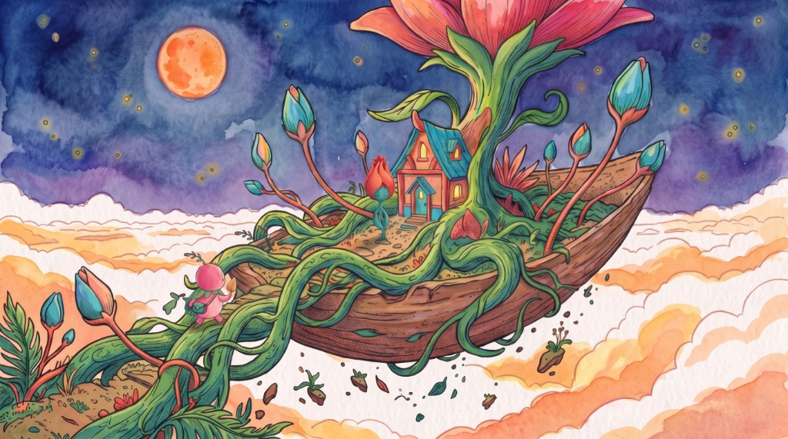

# Waterlight

Watercolour animation made by conversation. Write a line and the agent paints
it as a still watercolour. Talk the painting into shape — each attempt takes
about two seconds and costs a third of a cent — and when the frame is right,
bring it to life as a short, wordless film.

Any subject. One house style, held by the agent so you never have to describe
it.

Built on Livepeer Agent for the Atumera Livepeer Agent Hackathon.

The style reference below is a generated frame from Margarita Gruntova’s AI film. She is the author of the picture. In Waterlight it is used only to strengthen the watercolour: the hues, the brushstrokes, and the look of drawn art. The subject of a new painting still comes from the prompt.



## Why the still comes first

Regenerating video on every note is slow and expensive: about a dollar and a
minute per attempt. Refining a still instead is roughly 250x cheaper and 25x
faster, and it holds the hand-painted look far better, because the style is
locked in an image rather than re-guessed by a video model each time. It is
also the network's own advice — `ltx-25-i2v-pro` describes itself as "the
keeper animation from a locked keyframe" and points at the fast tier for
iteration.

## Running it

The app is not a public website. Anyone who clones the repo runs it on their own computer. `localhost` then means that computer, not the author's machine.

```bash
npm install
cp .env.example .env.local
npm run dev
```

Then open http://localhost:3000.

`.env.local` only needs `LIVEPEER_AGENT_URL=https://agent.livepeer.org/api/mcp/creative`. Do not set a Daydream `sk_` key. Paint and Animate spend the hackathon creative balance on that network.

## Where things live

```
src/
  app/
    layout.tsx              fonts + document shell
    globals.css             the whole design system (see below)
    page.tsx                renders <Studio />
    api/render/route.ts     POST — accepts a prompt, returns a jobId
    api/render/[jobId]/     GET  — poll for progress, then the film
    api/download/route.ts   streams a cross-origin film as an attachment
  components/
    studio.tsx              client root; owns the two page states
    prompt-composer.tsx     the textarea, in hero and compact sizes
    example-prompts.tsx     the six opening briefs
    film-stage.tsx          16:9 frame, progress wash, download
    refinement-panel.tsx    the conversation with the agent
  lib/
    types.ts                shared vocabulary, mirrors the agent's shapes
    style-contract.ts       wraps every prompt in the watercolour rules
    example-prompts.ts
    use-session.ts          conversation state + the polling loop
    agent/engine.ts         THE SEAM — mock today, Livepeer Agent next
references/
  *.jpg                     the official style references
  analyse.py                re-derives the palette numbers from them
```

## The visual language

The six frames in `references/` are the authority on how this should look.
`references/analyse.py` re-derives the numbers below if those frames change.

| Reference says | What we do about it |
| --- | --- |
| Median saturation 0.20–0.46, but p99 reaches 0.76–0.99 | The vivid colour is stated as a proportion — ~1% of the frame — not as a mood |
| Dominant hues are twilight indigo, slate teal, warm clay, cream paper | "Desaturated" means dusk, not ash; `--color-twilight` / `--color-slate` / `--color-clay` |
| Median value 0.45–0.69 | Frames are mid-to-dark; the empty film stage is twilight, not cream |
| Visible hand-inked linework over every wash | Named explicitly in the prompt — without it models return smooth digital gradients |
| Audible paper grain throughout | The `paper-grain` utility, worn by the page and the film frame alike |
| All 16:9, subject small in deep space | Wide cinematic framing is part of the contract |

The single biggest failure mode is a model quietly returning a clean digital
illustration. Most of the negative prompt exists to prevent exactly that.

### Decisions worth knowing

**The style is the product's job, not the user's.** Everything typed into the
app is wrapped by `src/lib/style-contract.ts` before it reaches the agent: the
medium, the colour discipline, the density, the framing and a hard no-text
rule. Three words still come back in the house style, and keeping it in one
file means the whole aesthetic is tunable from one place.

**Style and subject are kept strictly apart.** The contract describes only how
things are painted, never what to paint. An earlier version hardcoded one
particular scene and forced it onto every prompt, which made a tool for a
single story rather than for a style.

**Refinements restate the medium.** Models drift toward smooth digital
rendering a little with every edit, so each follow-up re-sends the medium and
colour clauses. Without that the look degrades across a conversation.

**Refinements are amendments, not new prompts.** A note like "let the colour
bleed further" is sent alongside the original brief, so the agent keeps the
same scene and composition rather than starting over.

**One seam to the agent.** `src/lib/agent/engine.ts` is the only file that knows
how films get made. It already speaks the async accept-then-poll contract that
Livepeer Agent's `create_media` / `get_create_media` use, so swapping the mock
for the real MCP client touches nothing else.

**Design system lives in CSS, not components.** `globals.css` defines the paper
palette, the two drifting watercolour blooms, and the paper grain — the grain is
an inline SVG fractal, so the app ships no image assets. Components only
reference tokens like `bg-paper` and `text-bud`.

**The wait is part of the piece.** Progress is a pale bud that breathes and a
colour wash that seeps across the page, with phase notes in the app's own voice
("Laying the first grey wash") instead of a percentage.

## What the network taught us

Everything here is measured against the live Livepeer Agent surface, not
assumed. The findings are load-bearing enough to be worth writing down.

**The pipeline is two stages because the network says so.** `ltx-25-i2v-pro`
describes itself as "the keeper animation from a locked keyframe" and points at
`ltx-25-i2v-fast` for iteration. Following that advice is also what makes the
product affordable: a wash is ~$0.003 and 2 seconds, an animation is ~$0.82 and
a minute. Refining on the still instead of the video makes iteration roughly
250x cheaper and 25x faster, and it holds the watercolour look far better,
since the style is locked in an image rather than re-guessed by a video model.

**`flux-schnell` silently ignores `negative_prompt`.** The agent is honest about
it and returns an `undeclared_param` warning, which the UI now surfaces. Every
prohibition therefore has to live in the positive prompt. This is not cosmetic:
the model was inventing house numbers and signing its own paintings, which
breaks the wordless rule outright. Naming "an unsigned painting… all four
corners are empty paper" is what actually stopped it.

**"Desaturated" is read as "one strongly tinted hue".** A probe came back a
saturated teal monochrome at 0.54 median saturation with 20% of the frame above
0.6. Asking for low chroma explicitly, and naming the blue-monochrome trap,
brought it to 0.38 median and 0.8% vivid — inside the reference band.

**"Dark" has to be asked for twice.** Without an explicit night/low-key clause
the model returns bright daylight: 0.70 median value against the references'
0.45-0.69. With it, 0.36-0.41.

**Video renders at 1080p, not the 720p the docs imply.** A 6-second render on
the fast tier was billed $0.819 — exactly 6 x the 1080p rate — while the
capability card says "we send 720p unless you name one". Quoting the 720p price
would understate the real charge by 45%, so `capabilities.ts` quotes 1080p.

## Current status

Livepeer Agent is wired through the creative MCP. A prompt paints a watercolor still; Animate turns that still into a silent 6-second film. The frame format follows the picker. A style reference can strengthen the hues and the brushstrokes.

### Submitting (Atumera Livepeer Agent Hackathon)

Deadline on [the submit page](https://atumera.com/hackathon/submit) is **26 September 2026, 23:59 Europe/Athens**. The form asks for the email, the six-digit code, the repository URL, and a demo video URL. Resubmitting with the same email and code replaces the entry.
